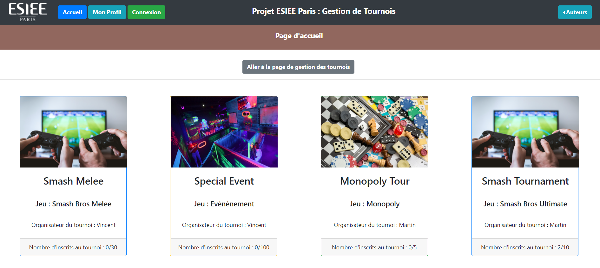
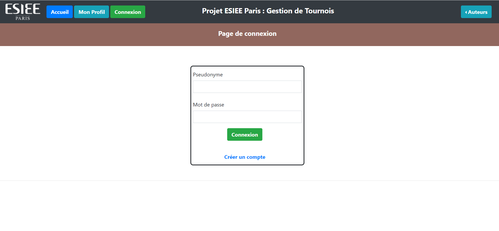
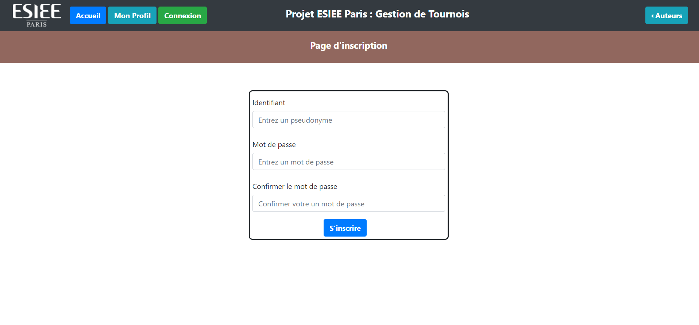
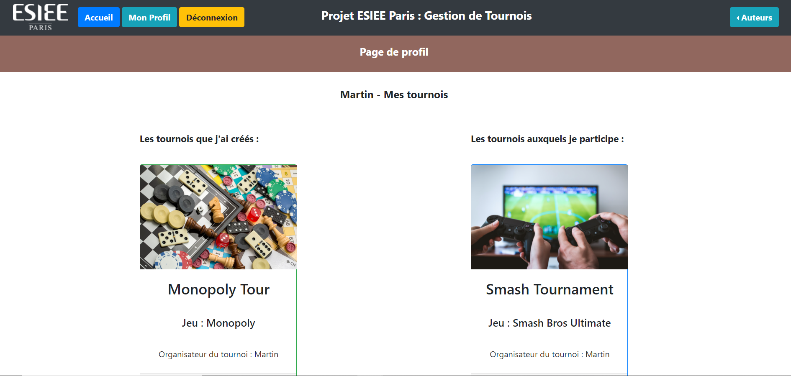
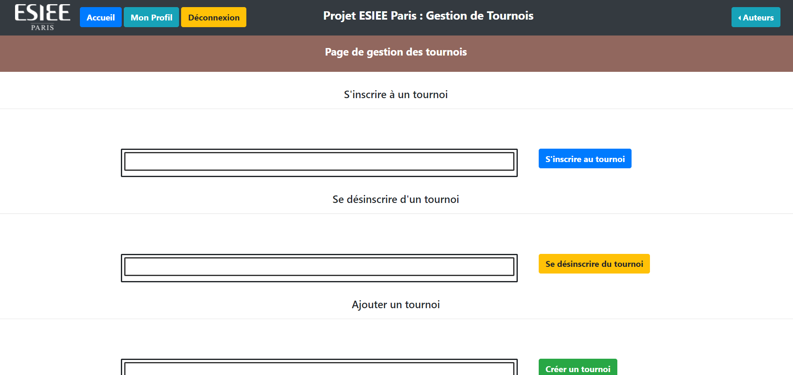

# Application Fullstack Data - Site de tournois <a href="https://www.esiee.fr/">  </a>

Projet codé en Python dont l'objectif est de créer une Application Fullstack.

## Table des matières

 - [Introduction](#introduction)
    - [Technologies Utilisées](#techno)
    - [Thème](#theme)
 - [User Guide](#user-guide)
    - [Télécharger le Projet](#installation)
    - [Docker](#docker)
    - [Utilisation](#utilisation)
 - [Developer Guide](#developer-guide)
 - [Application](#application)

## 1 - Introduction <a name="introduction" />

### Technologies Utilisées <a name="techno" />

Cette application web est codée en Python, basée sur le package <a href="https://flask.palletsprojects.com/en/1.1.x/">**Flask**</a> et **Dash** et tourne sur le **port 5000**.<br>
Ces données sont ensuite stockées dans une base de données <a href="https://en.wikipedia.org/wiki/Redis">**Redis**</a> tournant sur le **port 6379**.<br>

Le site est un ensemble de sous-applications *Dash* reliées entre elle en une application globale *Flask*. Pour chaque sous-application, le backend et le frontend ont été séparés.<br>

L'ensemble de l'application est déployée grâce à la technologie <a href="https://www.docker.com/">**Docker**</a>.

### Thème <a name="theme" />

Notre application a pour objectif de relier des personnes au travers de tournois, qu'il s'agisse de sport, jeux vidéos, jeux de plateaux, etc.
Notre site de gestion de tournoi a pour principales fonctionnalités de :

- Naviguer entre différentes pages internet
- Se connecter avec identifiant et mot de passe / Se déconnecter
- S'inscrire si ce n'est pas déjà fait
- Visualiser l'ensemble des tournois disponibles sur le site
- Visualiser sa page de profil, avec notamment les tournois que l'utilisateur a créés, et les tournois auxquels il participe
- S'inscrire à un tournoi / Se désinscrire d'un tournoi *(n'est pas encore fonctionnel)*
- Créer un tournoi / Supprimer un tournoi *(n'est pas encore fonctionnel)*

## 2 - User Guide <a name="user-guide" />

*Installer <a href="https://www.python.org/downloads/">__Python__</a> au préalable sur la machine utilisée (version 3+).*

### Télécharger le Projet <a name="installation" />

Si vous avez l'habitude d'utiliser <a href="https://git-scm.com/">Git</a>, utilisez la commande suivante :

`git clone https://github.com/Martin-Moritz/site_gestion_de_tournois.git`

Sinon, téléchargez simplement le dossier du projet en format .zip depuis cette page avec **Code -> Download ZIP**

### Docker <a name="docker" />

Cette application doit être déployée en utilisant la technologie Docker. Docker est un outil de virtualisation qui permet de lancer toutes les ressources nécessaires du projet sans demander de nombreuses manipulations.

Pour l'installation de **Docker**, suivez les informations suivantes selon votre système d'exploitation :

- **Windows :** https://docs.docker.com/docker-for-windows/install/
- **Linux :** https://docs.docker.com/engine/install/ubuntu/ puis installez **Docker Compose** : https://docs.docker.com/compose/install/
- **MacOs :** https://docs.docker.com/docker-for-mac/install/

Vous pouvez suivre la page complète de démarrage avec Docker sur la <a href="https://www.docker.com/get-started">page d'installation de Docker</a>.

### **Utilisation** <a name="utilisation" />

*Après avoir téléchargé le dossier du projet et installé Docker (voir ci-dessus) :*

**Lancez l'application en suivant les étapes suivantes :**

- Ouvrez l'invite de commandes

##### Ouvrir l'invite de commandes

> *Windows* et *Linux* : chercher en tapant '*terminal*' dans la barre de recherche.

- Placez-vous à la racine du projet

##### Se placer dans le dossier du projet

> Utiliser la commande `cd <chemin du répertoire>`<br>
> avec par exemple : 'cd Desktop/site_gestion_de_tournois'

- Démarrez Docker si ce n'est pas déjà fait (à l'aide de *Docker Desktop* par exemple)

- Installez les ressources nécessaires en exécutant la commande `docker-compose build`

Si c'est la première fois que vous exécutez cette commande, le téléchargement pourra prendre quelques minutes.

A la fin, si tout se passe bien, vous pourrez observer deux lignes avec un message de succès :

```
Successfully built 35afec8ab936
Successfully tagged site_gestion_de_tournois_web:latest
```

- Exécutez la commande `docker-compose up` pour démarrer l'application

- Attendez quelques instants le chargement de l'application [il peut arriver que l'application échoue à se lancer (*timeout*), dans ce cas retentez les commandes *docker-compose build*, puis *docker-compose up*]

- Ouvrez votre navigateur internet et affichez le dashboard <a href="http://127.0.0.1:5000/">ici</a> (l'application fonctionne à l'adresse http://127.0.0.1:5000/)

- Appuyez CTLR+C dans le terminal pour quitter l'application :

```
Gracefully stopping... (press Ctrl+C again to force)
Stopping site_gestion_de_tournois_web_1   ... done
Stopping redis_tournoi          ... done
```
## 3 - Developer Guide <a name="developer-guide" />

#### Architecture du projet

Le projet est constitué de :

- 3 dossiers :

  - **app** : contient le code de l'application web flask.
  - **data** : c'est ici que sont stockées toutes les données.
  - **images** : contient les images utilisées dans ce README.

* 5 fichiers :

  * **docker-compose.yml** : permet de définir les services qui composent l'application afin de les exécuter dans un environnement isolé.
  * **Dockerfile** : permet de construire l'image Docker en exécutant les étapes décrites dans ce même fichier.
  * **main.py** : fichier python permettant de faire démarrer l'application.
  * **requirements.txt** : liste des modules/packages utilisés dans cette application.
  * **README.md**

#### Architecture du dossier **app**

Le dossier *app* est constitue l'ensemble de l'application *Flask*, et comprend plusieurs sous-dossiers qui contiennent chacun frontend et backends des sous-applications *Dash*. Les principaux fichiers sont les suivants :

- **init.py** : permet de créer l'application *flask*.
- **callbacks.py** : contient les fonctions qui permettent d'actualiser l'application et la rendre dynamique.
- **dash.py** : permet de lier l'application *flask* avec les applications *Dash*.
- **data.py** : contient le code permettant de trier et d'utiliser les données contenues dans le dossier .data
- **figures.py** : contient les fonctions qui créent les différentes figures et graphiques du site.
- **layout.py** : contient le code permettant de disposer les différents composants et figures sur la page, déterminant ainsi l'aspect du de l'application.
- **navbar.py** : contient le code déterminant l'aspect de la barre de navigation située en haut de la page.
- **models.py** : contient la classe *User* du système de connexion/déconnexion.
- **forms.py** : contient les formulaires (inscription, connexion, etc.) des différentes pages du site.

#### Architecture du dossier **data**

Le dossier *data* est constitué de :

- un dossier **redis**, qui contient la sauvegarde de la base de données *redis*.
- des fichiers *.json* qui permettent d'initialiser des valeurs dans la base de données.
- un fichier **redis.py** qui contient le code permettant d'initiliser et de stocker les données dans la base de données *redis*.


## 4 - Application <a name="application" />

En haut de la page se trouvent les boutons permettant de naviguer entre les différentes pages.



La page d'accueil détails un certain nombre de tournois, créés par des utilisateurs du site, et organisés avec une date, un jeu, thème, etc.



La page de connexion permet de s'identifier à l'aide de son pseudonyme et de son mot de passe.<br>
Si vous ne possédez pas de compte, vous pouvez vous rediriger vers une page d'inscription.

*Vous pouvez visualiser si vous êtes connecté ou non en apercevant un bouton 'Connexion' ou 'Déconnexion' dans la barre de navigation.*

**Vous pourrez utiliser les identifiants '*Martin*' et '*123456*' pour visualiser une page de profil complète**



La page d'inscription comprend un formulaire complet et entièrement sécurisé pour ne pas récupérer de doublons dans les utilisateurs.<br>
Si votre inscription est réussie, vous serez redirigé vers la page de connexion.



Vous ne pouvez pas accéder à la page de profil si vous n'êtes pas préalablement connecté.

Une fois connecté, vous pouvez accéder à votre profil, et visualiser les différents tournois que vous avez créés, ainsi que les tournois auxquels vous participez.



**Ces dernières foncionnalités n'ont pas eu le temps de voir le jour !** Mais vous pourrez prochainement :
- Vous inscrire à un tournoi
- Vous désinscrire d'un tournoi
- Créer un tournoi
- Supprimer un tournoi que vous avez créé
